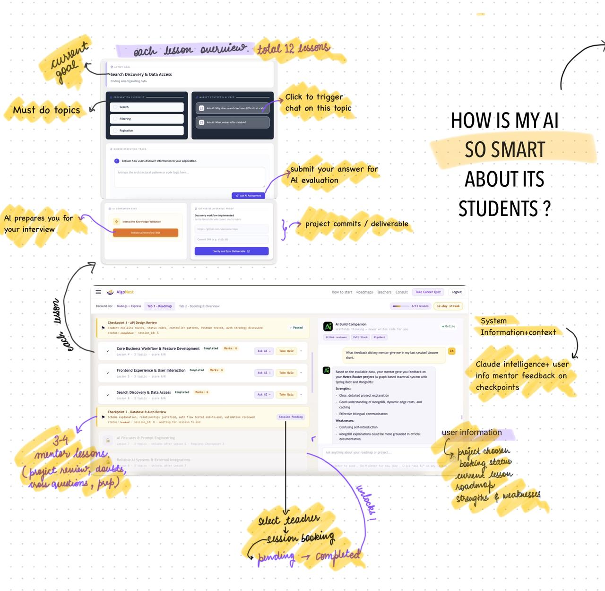
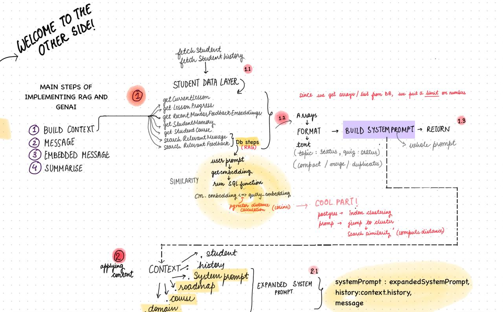
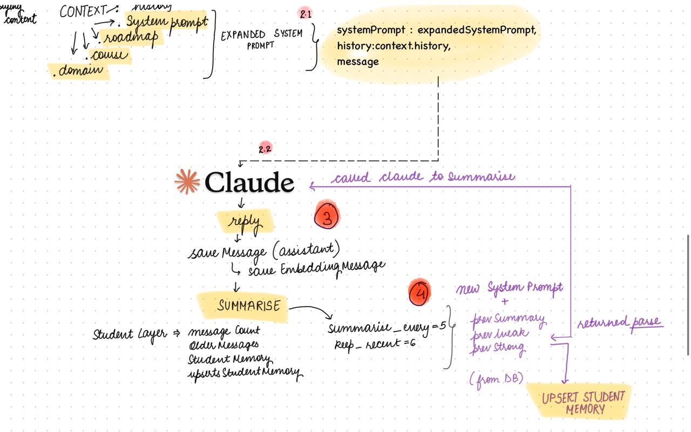

<!-- PROJECT LOGO / HEADER -->
 

  <a href="https://github.com/Ifrah-rauf/Algonest">
    <!--  -->
  </a>
  <h1 align="center">AlgoNest</h1>
  

    Dynamic Roadmaps with Mentor and AI collaboration to learn tech stack and ship real projects. 
     
    <a href="#table-of-contents"><strong>Explore the docs »</strong></a>
     
     
    <a href="https://github.com/Ifrah-rauf/Algonest/issues">Report Bug</a>
    ·
    <a href="https://github.com/Ifrah-rauf/Algonest/issues">Request Feature</a>
  

<!-- TABLE OF CONTENTS -->

  
<strong>Table of Contents</strong>

  <ol>
    <li><a href="#about-the-project">About The Project</a></li>
    <li><a href="#built-with">Built With</a></li>
    <li><a href="#getting-started">Getting Started</a></li>
    <li><a href="#project-architecture">Project Architecture</a></li>
    <li><a href="#modules-and-services">Modules and Services</a></li>
    <li><a href="#roadmap">Roadmap</a></li>
    <li><a href="#contributing">Contributing</a></li>
  </ol>

<!-- ABOUT THE PROJECT -->
<h2 id="about-the-project">About The Project</h2>

  AlgoNest is a post-course readiness platform for Indian engineering students (B.Tech, BCA, MCA) — especially those from Tier-2/3 colleges who have already completed a course or bootcamp but still can't defend their own projects in interviews. AlgoNest doesn't teach CS from scratch. It closes the gap between having finished a course and being able to prove you understood it, through structured human assessment backed by AI.

In an AI-saturated market, verified human proof is worth more than another certificate.

<h3>The Problem</h3>
Students today have unlimited access to courses, tutorials, and AI coding assistants. What they don't have is anyone checking whether they can actually explain what they built. The result: candidates who've "completed" a full-stack course but freeze the moment an interviewer asks why they made a specific architectural decision.
Resources were never the bottleneck. Accountability was.

<h3>The Solution</h3>
AlgoNest sits after the course, not instead of it, and produces one concrete, verifiable output: a readiness verdict plus company-targeting recommendations — something no course platform or generic mentorship marketplace delivers.

  
<em>Dynamic Roadmap Diagram prepared by Ifrah</em>

<!-- TECH STACK -->
<h2 id="tech-stack">Tech Stack</h2>

  A breakdown of the core technologies, frameworks, and foundational architecture powering the system infrastructure.

<h3>Frontend & Client Side</h3>
<ul>
  <li><strong>React.js:</strong> Core modern UI framework handling single-page application rendering.</li>
  <li><strong>Tailwind CSS:</strong> Primary utility-first styling framework (with localized CSS modules / inline-style React implemented alongside within legacy layouts).</li>
  <li><strong>react-router-dom:</strong> Declarative client-side routing and layout management.</li>
  <li><strong>driver.js:</strong> Interactive overlay library driving contextual, guided onboarding tours for new users.</li>
</ul>

<h3>Backend & Infrastructure</h3>
<ul>
  <li><strong>Node.js + Express.js:</strong> Enterprise runtime and web framework managing API routing and middleware pipelines.</li>
  <li><strong>JWT Authentication:</strong> Secure, stateless session management via JSON Web Tokens.</li>
  <li><strong>SSE (Server-Sent Events):</strong> Persistent, unidirectional HTTP channels utilized for real-time streaming of AI engine responses to the UI.</li>
</ul>

<h3>Database & Vector Layer</h3>
<ul>
  <li><strong>Supabase (PostgreSQL):</strong> Core relational database layer handling core application state.</li>
  <li><strong>pg_cron:</strong> Native internal database schedule automation executing session reminders, recurring availability rollovers, memory/summary batch processing, and expiration cleanups.</li>
  <li><strong>pgvector:</strong> Vector database extensions facilitating multidimensional embedding storage for optimized, semantic search.</li>
</ul>

<h3>Artificial Intelligence Engine</h3>

  Deep model tier and contextual processing framework anchored heavily around Retrieval-Augmented Generation (RAG).

<ul>
  <li><strong>Anthropic Claude API (Haiku):</strong> Lightweight, ultra-low-latency model mapped to programmatic extraction (memory synthesis, system tagging, and prompt classification).</li>
  <li><strong>Anthropic Claude API (Sonnet):</strong> Deep reasoning engine powering the live AI Build Companion, analytical scorecard generation, and heavy contextual assessments.</li>
  <li><strong>RAG Core Pipeline:</strong> Student chat history, dynamic workspace project metadata, and static syllabus roadmaps are systematically vectorized and queried via <code>pgvector</code>. This enforces that the Build Companion grounds logic in explicit workspace parameters rather than generic logic models.</li>
</ul>

<blockquote>
  <strong>Three-Layer Memory System:</strong> User interaction models are segmented into three operational states to optimize context window efficiency:
  <ol>
    <li>Highly structured, relational <code>student_profile</code> tables.</li>
    <li>A flexible, unstructured <code>student_memories</code> table managing category-tagged behavior observations.</li>
    <li>A sliding state tracking the immediate, recent conversation window history.</li>
  </ol>
  <em>System Constraint:</em> AI pipelines are structured as low-frequency, high-value invocations backed by manual engineering fallbacks. Under no circumstances is an AI service treated as a single-point-of-failure or a hard dependency for core system critical paths.
</blockquote>

<h3>Third-Party Integrations</h3>
<ul>
  <li><strong>Zoom API:</strong> Deep automation layer driving the entire synchronous session lifecycle. Automates server-side meeting generation, dynamically assigns secure <code>join_url</code> and <code>start_url</code> endpoints at booking confirmation, and executes post-call webhook reconciliation to pull telemetry metrics for analytical scorecard tracking.</li>
</ul>

<!-- GETTING STARTED -->
<h2 id="getting-started">Getting Started</h2>

To get a local copy up and running, follow these simple steps.

<h3>Installation & Setup</h3>
<ol>
  <li>Clone the repo: <pre><code>git clone https://github.com/yourusername/your-repo.git</code></pre></li>
  <li>Install dependencies: <pre><code>npm install</code></pre></li>
  <li>Set up your <code>.env</code> file based on <code>.env.example</code></li>
  <li>Run the development server: <pre><code>npm run dev</code></pre></li>
</ol>

<!-- PROJECT ARCHITECTURE -->
<!-- PROJECT ARCHITECTURE -->
<h2 id="project-architecture">Project Architecture</h2>

<h3>Data Model (High Level)</h3>

  The system's database schema is built around modular, decoupled components that connect user identity to commercial access, mentor scheduling, and roadmap progression.

<ul>
  <li><strong>auth:</strong> Central identity table utilizing role-based access control (<code>STUDENT</code> / <code>TEACHER</code>). This serves as the primary root record referenced by both the student and teacher profiles.</li>
  <li><strong>student / teacher:</strong> Profile-specific metadata tables, linked via a strict 1:1 relationship to the <code>auth</code> table using the <code>uid</code>.</li>
  <li><strong>plan / plan_outline / booking / payment:</strong> The commercial layer. Tracks what a student has purchased, the access control levels it unlocks, and transactional payment history.</li>
  <li><strong>availability / timeslot / slotbooking:</strong> The mentor availability matrix. Mentor windows are dynamically sliced into bookable slots, reserved via <code>slotbooking</code>, and eventually promoted to a confirmed session.</li>
  <li><strong>session / session_attachment:</strong> The core meeting execution record. Integrates directly with Zoom to track duration, feedback scores, completion status, and related artifacts (e.g., scorecards, resumes, code links).</li>
  <li><strong>lessons / lesson_topics / lesson_progress:</strong> The roadmap skeleton. Defines ordered lessons with explicit prerequisites, granular topics per lesson (including <code>applied_task</code> and <code>ai_note</code> configurations for the Build Companion), and per-student execution tracking.</li>
  <li><strong>checkpoints / support_stages:</strong> Milestone gates embedded within a roadmap. These handle quality assurance blocks that optionally require explicit teacher sign-off, tied directly to a specific commercial <code>booking</code>.</li>
  <li><strong>specialisation / languages / frameworks:</strong> Teacher-side taxonomy tagging used by the matching engine to pair mentors with specific student technical requirements.</li>
  <li><strong>testimonials:</strong> Student success stories and feedback indicators surfaced on the public marketing site.</li>
</ul>

<blockquote>
  <strong>Note on Legacy Schema Architecture:</strong> The current schema retains generic <code>plan</code>/<code>booking</code> terminology derived from an earlier package-based pricing model. Feature sets like <em>Grill Sessions</em>, <em>CS Fundamentals</em>, and <em>Project Roadmaps</em> are fully implemented as distinct plan types abstracted on top of this exact same booking/session infrastructure.
</blockquote>

<h3>AI Build Companion — Context Awareness</h3>

  The AI Build Companion operates with localized state tracking. At any point in an active conversation, the engine resolves the following telemetry context vectors:

<ol>
  <li><strong>Roadmap State:</strong> Real-time positioning within the educational pipeline (derived from <code>lesson_progress</code> and <code>checkpoints</code>).</li>
  <li><strong>Workspace State:</strong> Active structure and state of the student's current local codebase.</li>
  <li><strong>Historical Vector State:</strong> Past roadblocks, queries, and recurring conceptual struggle patterns (retrieved via <code>student_memories</code> utilizing semantic embedding similarity search).</li>
</ol>

<blockquote>
  <strong>⚠️ Architectural Hard Constraint:</strong> Enforced strictly at the LLM system-prompt level, the Build Companion scaffolds and instructs—it <em>never</em> completes tasks. If a student requests direct code generation, the agent explicitly blocks execution and pivots to a guided, Socratic questioning sequence.
</blockquote>

<h3>Session Automation Flow</h3>

  The lifecycle of a mentorship connection is managed via automated event transitions:

<table>
  <thead>
    <tr>
      <th>Step</th>
      <th>Actor/System</th>
      <th>Action & System Side-Effects</th>
    </tr>
  </thead>
  <tbody>
    <tr>
      <td><strong>1</strong></td>
      <td>Mentor</td>
      <td>Sets open availability windows, which the system automatically slices into discrete <code>timeslot</code> records.</td>
    </tr>
    <tr>
      <td><strong>2</strong></td>
      <td>Student</td>
      <td>Selects an open window, generating a pending <code>slotbooking</code> record.</td>
    </tr>
    <tr>
      <td><strong>3</strong></td>
      <td>System API</td>
      <td>Upon checkout/confirmation, a dedicated meeting is provisioned via the Zoom API; <code>join_url</code> and <code>start_url</code> keys are written to the live <code>session</code> record.</td>
    </tr>
    <tr>
      <td><strong>4</strong></td>
      <td>Database Worker</td>
      <td>Native <code>pg_cron</code> periodic jobs handle automated Slack/email reminders and execute automated cleanup for no-shows or expired holds.</td>
    </tr>
    <tr>
      <td><strong>5</strong></td>
      <td>Post-Session Evaluation</td>
      <td>Following meeting termination, mentor feedback notes and categorical scorecard data are flushed back into <code>session</code> and <code>session_attachment</code> tables.</td>
    </tr>
  </tbody>
</table>
<!-- If you have an architecture diagram image, place it here -->

  
<em>Architecture Diagram prepared by Ifrah</em>

<!-- MODULES AND SERVICES (Repeatable Structure) -->
<h2 id="modules-and-services">Modules and Services</h2>

This project is broken down into modular components. Expand each section below to see specific details.

<!-- START REPEATABLE MODULE BLOCK -->

  
📦 <strong>Module 1: Auth Service</strong> (Click to expand)

   
  <blockquote>
    Handles user authentication, token generation, and session management.
  </blockquote>
  
  <h4>Tech Stack / Dependencies</h4>
  <ul>
    <li>Express.js</li>
    <li>JWT (JsonWebToken)</li>
    <li>Redis (Session caching)</li>
  </ul>

  <h4>Key Directories</h4>
  <ul>
    <li><code>/src/auth/controllers</code> - Request handlers</li>
    <li><code>/src/auth/middleware</code> - Route guards and validation</li>
  </ul>

  <h4>API Endpoints / Usage</h4>
  <table>
    <thead>
      <tr>
        <th>Method</th>
        <th>Endpoint</th>
        <th>Description</th>
      </tr>
    </thead>
    <tbody>
      <tr>
        <td><code>POST</code></td>
        <td><code>/api/v1/auth/register</code></td>
        <td>Registers a new user account.</td>
      </tr>
      <tr>
        <td><code>POST</code></td>
        <td><code>/api/v1/auth/login</code></td>
        <td>Authenticates user and returns a JWT.</td>
      </tr>
    </tbody>
  </table>

<!-- END REPEATABLE MODULE BLOCK -->

<!-- START REPEATABLE MODULE BLOCK -->

  
<strong>Module 2: Core Data Engine</strong> (Click to expand)

   
  <blockquote>
    Processes incoming data packets, executes pipeline validation, and writes to the database.
  </blockquote>
  
  <h4>Tech Stack / Dependencies</h4>
  <ul>
    <li>Python / FastAPI</li>
    <li>PostgreSQL</li>
  </ul>

  <h4>API Endpoints / Usage</h4>
  <table>
    <thead>
      <tr>
        <th>Method</th>
        <th>Endpoint</th>
        <th>Description</th>
      </tr>
    </thead>
    <tbody>
      <tr>
        <td><code>GET</code></td>
        <td><code>/api/v1/data/metrics</code></td>
        <td>Fetches aggregated system performance metrics.</td>
      </tr>
    </tbody>
  </table>

<!-- END REPEATABLE MODULE BLOCK -->

